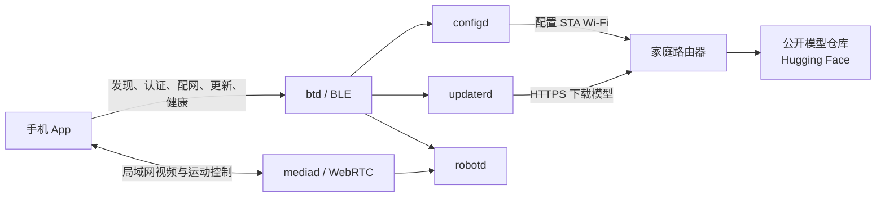
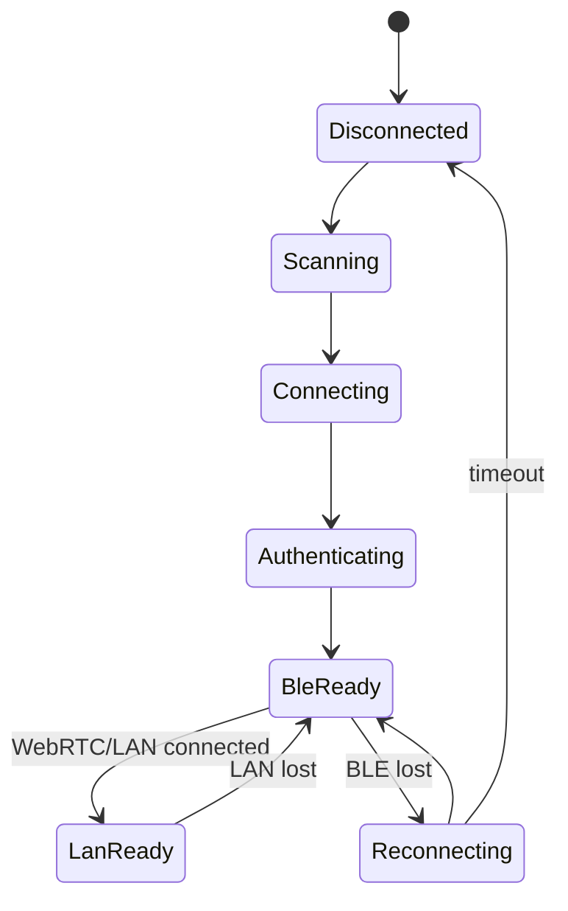
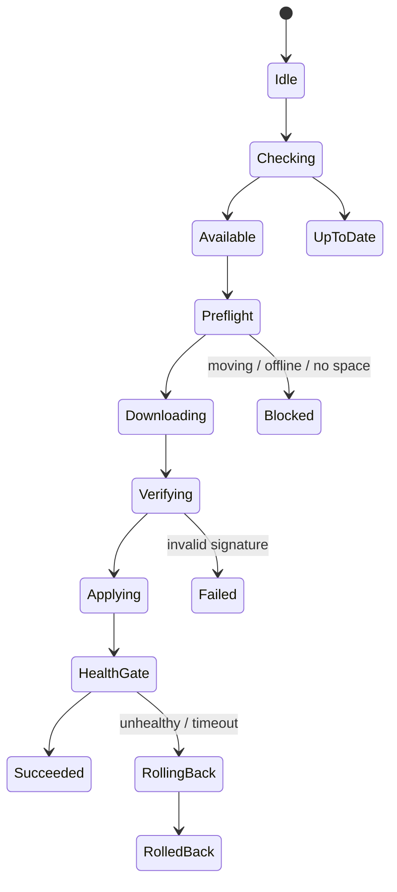

# MicroDuck 控制 App 产品与系统设计

状态：产品设计草案 · 日期：2026-09-11

## 1. 产品定位

MicroDuck App 是鸭子的现场控制台，不是厂商云的遥控器。

核心原则：

1. **设备是主体。** 配网、状态、更新和回滚都直接面向用户手上的 MicroDuck。
2. **双通道。** BLE 负责发现、认证、配网、健康和更新；运动控制与视频走局域网/WebRTC，绝不经 BLE。
3. **模型由设备下载。** App 只发更新指令和显示进度，MicroDuck 用自己的 Wi-Fi 从公开仓库下载签名模型。
4. **无账号也能工作。** MVP 不需要注册、登录、绑定厂商账号或自建业务云。
5. **用户始终有退路。** 普通更新由用户确认；失败自动回滚；更新后可一键回到上一版本。
6. **开放但不失控。** 文件可以托管在公开仓库，但设备只运行受信任密钥签名且接口兼容的模型。

一句话：

> 手机是鸭子的现场遥控器，鸭子是产品，公开仓库只是文件架。

## 2. 目标用户与核心任务

### 2.1 用户

- 普通拥有者：第一次连接、配网、查看状态、更新模型、执行常用动作。
- 创作者/研究者：试用新模型、切换已安装版本、读取详细诊断。
- 支持人员：不依赖 SSH 查看健康、版本和更新记录。

### 2.2 MVP 核心任务

1. 在多只鸭子中找到并连接自己的设备。
2. 通过 BLE 给鸭子配置 Wi-Fi。
3. 查看设备是否健康、当前网络和模型版本。
4. 在 App 点一下，让鸭子自行下载并安装模型。
5. 更新中断开 App 后，重新连接仍能看到真实进度和结果。
6. 新模型表现不佳时，离线回到上一版本。

## 3. 产品边界

### 3.1 MVP

- BLE 扫描、连接和 PIN 认证
- Wi-Fi 扫描、配置、状态和重新配网
- 设备首页：连接、运行、电量、网络、更新摘要
- 模型槽列表：当前版本、可用更新、来源、签名和兼容性
- 模型更新：确认、进度、结果、自动回滚、一键手动回退
- 健康：控制循环、电池、温度、服务和模型状态
- 设备名称、重启、更新记录、开源许可证

### 3.2 第二阶段

- 同局域网运动控制和实时状态
- WebRTC 视频、音频和控制 data channel
- 技能快捷动作
- 游戏手柄配对
- 详细更新日志导出

### 3.3 暂不做

- 厂商账号、家庭空间、会员或商城
- 厂商云作为设备控制中枢
- BLE 传输模型文件
- 从任意 URL 安装未签名模型
- 第三方模型开放市场
- 在一个固定槽位同时维护多个不同来源并自动择优
- 远程静默操作设备或远程绕过安全层
- App 内恢复出厂；`resetToGolden` 继续禁止通过 BLE

## 4. 连接架构



### 4.1 三条链路

| 链路 | 用途 | 约束 |
|---|---|---|
| 手机 ↔ MicroDuck BLE | 发现、认证、配网、健康、更新命令和进度 | 不传模型，不发运动指令 |
| MicroDuck ↔ 公开仓库 | HTTPS 下载模型与签名 | 由设备自己的 Wi-Fi 完成 |
| 手机 ↔ MicroDuck 局域网/WebRTC | 视频、低延迟运动控制和实时状态 | BLE 不可作为降级控制链路 |

手机不必与鸭子连接同一 Wi-Fi 才能发起模型更新。只要手机在 BLE 范围内且鸭子自己可以访问互联网，更新就能进行。

## 5. 系统设计

## 5.1 App 前端

推荐跨平台使用 Flutter；BLE、后台恢复和 WebRTC 保留原生适配层。MVP 不应把业务状态写进页面组件。

```text
Presentation
├── onboarding       发现、PIN、配网
├── home             设备摘要
├── models           模型槽、更新、版本
├── health           健康、服务、日志
└── control          局域网/WebRTC 控制（第二阶段）

Application
├── DeviceSession    当前设备、身份、连接状态
├── Provisioning     Wi-Fi 配网状态机
├── UpdateWorkflow   检查、应用、订阅、恢复、回退
└── ControlSession   WebRTC、deadman、意图发送

Data
├── BleTransport     GATT 分片、NDJSON 重组
├── RpcClient        duck-ipc-proto 对应的 typed calls
├── WebRtcTransport  control / teleop data channel
├── Repositories     device / network / update / health
└── LocalStore       serial、peripheral id、昵称、最后状态
```

### 前端关键约束

- iOS BLE 扫描不使用 service filter；按已存 peripheral identifier、广播 UUID、名称逐级判断。
- 用 SoC serial 作为设备长期主键；peripheral identifier 只是快速重连缓存。
- API 版本不一致时警告并继续，实际调用失败再显示 `METHOD_NOT_FOUND` 或 `INVALID_PARAMS`。
- 更新进度是设备状态，不是页面临时状态。页面退出、App 进后台或 BLE 断开都不能把更新标记为失败。
- App 不存 Wi-Fi 密码；发送完成即清除输入和内存中的可恢复副本。
- 控制页只有在局域网/WebRTC 控制通道建立后才能启用摇杆。
- 连续控制采用 deadman：松手立即发零速度；数据通道中断由 `robotd` 自行停机。

## 5.2 设备端“后端”

MVP 没有传统业务后端。后端由设备上的服务组成：

| 服务 | App 使用的职责 |
|---|---|
| `btd` | BLE 会话、PIN 认证、RPC 转发、安全路由边界 |
| `configd` | Wi-Fi、名称、身份、服务状态、重启 |
| `updaterd` | 检查、下载、验签、原子切换、健康门、回滚、日志 |
| `robotd` | 设备健康、50 Hz 控制、安全权威、模型加载 |
| `mediad` | 第二阶段局域网/WebRTC 视频和控制入口 |

现有 BLE RPC 可直接支撑 MVP：

```text
hello
system.authenticate
system.info
system.setName
system.services
system.reboot
net.status
net.scan
net.connect
net.forget
robot.health
update.check
update.apply
update.status
update.subscribe
update.listInstalled
update.rollback
update.select
update.log
update.show
```

继续禁止经 BLE 调用：

- `robot.move`、`robot.head`、`robot.do` 等运动控制
- `update.pin`
- `update.resetToGolden`
- 配对 PIN 读取和修改

## 5.3 模型发布端

公开 Hugging Face 仓库只是静态发布源，不拥有设备：

```text
microduck-walk/
├── manifest.json
├── manifest.json.minisig
├── model-walk-1.3.0.tar.zst
└── model-walk-1.3.0.tar.zst.minisig
```

模型包至少包括：

- 固定角色名，如 `walk.onnx`
- 版本和构建来源
- `model_api`
- 输入输出合同：`obs[1,61] -> actions[1,14]`
- 最低硬件版本
- changelog

安装顺序：

```text
安全预检
→ 拉取并验证 manifest
→ 下载 artifact
→ 校验 SHA-256 和 minisign
→ 在非活动目录解压并预加载验证形状
→ 原子切换 current
→ 重载或重启 robotd
→ robot.health
→ 成功提交 / 失败自动回滚
```

MVP 可以先安全重启 `robotd`。SIGHUP 无掉帧热切换放在后续，避免它阻塞“手机点一下更新”。

## 5.4 可选云服务

MVP 不需要自建云。规模化后可增加一个**不在控制链路上**的可选服务：

- 发布目录和模型介绍
- 匿名崩溃/更新成功率（用户明确同意）
- 发布撤回和版本风险提示
- 推送“有新模型”，但安装仍由用户在现场确认

即使该服务关闭，BLE 配网、设备控制、已安装模型和回滚仍应正常。

## 6. 信息架构

```text
启动
├── 已有设备 → 自动重连
└── 添加设备
    ├── 蓝牙权限说明
    ├── 扫描与选择
    ├── PIN 认证
    └── Wi-Fi 配网

首页
├── 设备摘要
├── 更新提示
└── 最近状态

模型
├── 固定槽列表
├── 模型详情
├── 更新确认
├── 更新进度
├── 更新结果
└── 已安装版本 / 回退

设置
├── 设备名称
├── 网络
├── 更新记录
├── 重启
├── 高级诊断
└── 开源与许可证
```

### 最终导航（冻结）

底部导航固定为四项，名称、顺序和职责不再按页面变化：

| 标签 | 职责 |
|---|---|
| 首页 | 当前设备摘要、连接、电量、快捷入口和更新提醒 |
| 控制 | 局域网/WebRTC 实时控制、模式和快捷动作 |
| 模型 | 固定模型槽、检查更新、版本和回退 |
| 设置 | 健康、网络、名称、更新记录、诊断和重启 |

以下页面不显示底部导航，因为它们是有明确开始和结束的全屏任务，而不是新的一级栏目：

- 首次添加设备、PIN 认证和 Wi-Fi 配网
- 更新确认、更新进度和更新结果

任务结束后的落点固定：配网完成进入首页；取消更新返回模型；更新完成确认后返回模型。健康归入设置，动作归入控制，“能力”“状态”“数据”“设备”都不再作为底部标签。

控制未实现或不在同一局域网时保留入口，但显示原因和建立连接的动作，不显示可操作摇杆。

## 7. 页面设计

统一视觉：

- 暖白背景 `#F7F4ED`
- MicroDuck 黄 `#F5B82E`
- 主文字 `#20242A`
- 健康/连接绿 `#2AA198`
- 错误红仅用于停止、失败和高风险动作
- 卡片圆角 20 px，最小触摸区域 44 × 44 pt
- 机器人形象友好，但健康、更新和安全文案保持工程可信度
- 不出现头像、会员、商城或云账号状态

### P01 添加设备

- 展示正在扫描和候选设备
- 信号强度只用于排序，不作为身份
- 明确“通过蓝牙直接连接，不经过厂商云”
- 连接后读取 `system.info`，用 serial 确认并落库

状态：扫描中、无结果、蓝牙未授权、连接中、PIN 错误、连接成功。

### P02 Wi-Fi 配网

- 通过 `net.scan` 展示附近网络
- 输入密码并调用 `net.connect`
- 显示真实结果：已连接、密码错误、网络消失、超时
- 说明 Wi-Fi 是鸭子用于下载模型的网络

不要把“NetworkManager 接受了配置”当成功，必须等目标连接真的激活。

### P03 首页

首页不再放“遥控 / 动作 / 模型 / 健康”四个宫格。前两个与控制页重叠，后两个与底部导航重叠；重复入口使用户无法判断哪个是主路径，也浪费首页首屏。

| 控件 | 点击行为 | 状态与反馈 |
|---|---|---|
| `Coincoin⌄` 设备名 | 打开设备选择器；展示已保存设备和“添加 MicroDuck” | 切换后刷新整页快照；当前操作未结束时先提示 |
| `现场直连 ›` | 打开连接详情：BLE、设备 Wi-Fi、局域网/WebRTC | 可在详情中重连 BLE 或进入重新配网；不把三种“在线”混成一个灯 |
| 设备摘要卡 | **不可点击** | 在线、已停止、电量和 Wi-Fi 都是只读状态；无箭头、无按压态 |
| `查看更新` | 进入对应模型详情 | 不直接安装；用户在详情页确认版本、大小和安全条件 |
| 最近状态 | **不可点击** | 展示设备安全停稳、控制循环和时间；详细健康统一从“设置”进入 |
| 首页 Tab | 回到首页顶部 | 重复点击滚到顶部并刷新过期快照 |
| 控制 Tab | 进入控制页 | 局域网控制通道不可用时显示连接引导，不显示可操作摇杆 |
| 模型 Tab | 进入模型槽列表 | 保留之前的滚动位置 |
| 设置 Tab | 进入健康和设备设置 | 保留子页面返回位置 |

首页原则：只回答“这只鸭子现在怎么样，有没有事情需要我处理”，不做第二个导航页。

### P04 控制

控制页加入摄像头实时画面。旧稿中的“视线”不是视频，它原本想表示头部朝向，命名有歧义；最终改为“头部 / 摄像头”，并把摄像头视频作为独立区域放在页面上方。摄像头固定在头部，因此移动头部会改变画面方向。

| 控件 | 点击/手势行为 | 状态与反馈 |
|---|---|---|
| `局域网低延迟 · 安全 ›` | 打开控制连接详情 | 展示视频、control 和 teleop 三条状态；任一控制关键链路失败即禁用运动控件 |
| 摄像头画面 | 只展示实时 H.264 视频，不默认响应点击 | 避免让用户误以为点画面能指定三维注视点；掉线显示重连遮罩 |
| 静音 | 切换手机端播放声音 | 只影响播放，不关闭机器人麦克风采集；图标立即反馈 |
| 全屏 | 进入横屏视频控制模式 | 退出后保持控制状态；系统锁屏前先发停止 |
| 移动摇杆 | 连续发送 `robot.move {vx, vy, vyaw}` | 松手弹回中心并立即发送零速度；链路断开由设备 deadman 停止 |
| 头部 / 摄像头摇杆 | 连续发送 `robot.head`，控制 yaw/pitch | 松手后保持最后头部角度，不自动回正；双击摇杆回到正前方 |
| 停止 | 调用 `robot.stop`，立即清零移动意图 | 不关闭策略、不切断关节扭矩，因此不会让机器人突然倒下 |
| 坐下 / 站起 | 根据实时姿态显示一个状态化按钮，调用 `Skill::SitToggle` | **不同时放两个按钮。** API 是 toggle；姿态未知时禁用，避免“点坐下却站起” |
| 捡起 | 调用 `Skill::GroundPick` | 约 3 秒；执行期间移动摇杆禁用，停止仍可用 |
| 左踢 | 调用 `Skill::KickLeft` | 与右踢分开，避免弹窗增加操作步数；执行期间防止重复触发 |
| 右踢 | 调用 `Skill::KickRight` | 同上 |
| 叫一声 | 调用 `robot.sound` 的默认 chirp | 无声音能力时禁用并说明原因 |
| `•••` | 打开低频控制菜单 | 包含双足/滚轮模式、手柄状态；模式切换长按确认，避免误触 |
| 四个底部 Tab | 与首页相同 | 离开控制页前发送零速度；进入后台、来电、锁屏同样处理 |

控制页安全优先级：

1. 停止按钮在技能执行和网络抖动时始终可用。
2. 只有局域网/WebRTC control 和 teleop 均可用，才启用摇杆。
3. 当前 `mediad` 已有摄像头视频和可靠 `control` data channel；低延迟、不重传的 `teleop` data channel 尚未实现。在它完成前，效果图中的摇杆必须显示为禁用，不能退化到 BLE 控制。
4. `robotd` 的安全层拥有最终决定权；App 展示“已请求”和“实际执行”差异。

### P05 模型

模型页保持固定能力槽，不表现为应用商店，也不提供“全部更新”：模型独立版本、独立健康门，一次更新一个更容易判断哪个变化导致行为差异。

| 控件 | 点击行为 | 状态与反馈 |
|---|---|---|
| 右上刷新 | 调用 `update.check` 检查所有模型 component | 只检查、不安装；更新期间立即返回 busy，不显示无限转圈 |
| 下拉刷新 | 与右上刷新相同 | 两者是同一动作的手势与可发现按钮，不是两个逻辑 |
| 模型名称/信息区 `›` | 打开模型详情 | 展示版本、来源、签名、模型 API、61→14 合同、changelog 和已安装版本 |
| `有更新` | **不可点击的状态标签** | 只传达状态，真正动作是明确的“更新”按钮 |
| `已是最新` | **不可点击的状态标签** | 无按压态、无箭头 |
| `更新` | 打开更新确认页 | 先展示 v1.2.0→v1.3.0、大小、来源和“鸭子停稳”要求；确认后调用 `update.apply` |
| 已安装版本 | 在详情页点某版本后确认 `update.select` | 不联网；切换后仍经过健康门，失败自动回到原版本 |
| 回到上一版本 | 在详情页二次确认 `update.rollback` | 明确显示回退目标；不出现“恢复出厂”措辞 |
| 模型 Tab | 回到槽位列表 | 更新在后台时顶部保留全局进度条，点击进入全屏进度 |

统一禁用规则：

- 鸭子正在运动：禁用更新并提供“先停止鸭子”动作。
- 鸭子没有互联网：禁用新版本下载，但已安装版本切换和回退仍可用。
- 签名或兼容性失败：不可提供“仍然安装”绕过按钮。
- 一个更新正在进行：其他更新按钮禁用，模型详情仍可查看。

### P06 更新进度

- 清晰拆分安全检查、下载、验签、切换、健康检查
- 说明“蓝牙只收进度，下载由鸭子的 Wi-Fi 完成”
- 不提供危险的中途取消
- App 进入后台后允许设备继续；恢复时先读 `update.status` 再订阅

### P07 更新结果与版本

- 成功：签名、健康和当前版本
- 失败：原始失败阶段、是否已自动回滚、当前实际版本
- “试走一下”在建立局域网控制通道后启用
- “回到上一版本”二次确认，调用 `update.rollback`
- 旧版本选择调用 `update.select`

### P08 设备与健康

- 控制循环、供电、电池、最高温度、当前模型
- BLE、Wi-Fi、最后成功检查时间
- 名称、重新配网、更新记录、开源许可证、高级诊断
- “重启设备”与普通设置分区
- 不在 App 暴露恢复出厂

## 8. 关键状态机

### 8.1 设备会话



`BleReady` 已足够配网、健康和更新；只有 `LanReady` 可运动控制。

### 8.2 模型更新



App 不能根据 BLE 是否连接推导更新结果。唯一真相是 `updaterd` 返回的状态、日志和当前版本。

## 9. 错误与边界体验

| 情况 | App 行为 |
|---|---|
| 鸭子没网 | 保留 BLE；提示重新配网；回退已安装版本仍可用 |
| 手机断开蓝牙 | 显示“设备仍在继续”；重连后恢复进度 |
| App 被系统杀死 | 再打开先读 `update.status` 和 `last_attempt` |
| 模型签名错误 | 明确“未通过设备信任校验”，禁止绕过 |
| 模型 61→14 不匹配 | 在切换前拒绝，保留现有模型 |
| 鸭子正在运动 | `safeToRestart` 拒绝；引导用户停稳后重试 |
| 健康门失败 | 显示已自动回滚以及当前实际版本 |
| 更新后表现不佳 | 提供一键回到上一版本 |
| API 版本不同 | 警告但不全局阻断；按具体 RPC 错误降级 |
| 多只鸭子同处一室 | serial 做身份；名称和 RSSI 辅助选择 |
| 设备无响应 | 保留重新连接、健康和更新恢复入口，不建议立即重启 |

## 10. 安全与隐私

- 发布前必须完成并验证 BLE 加密认证，Wi-Fi 密码不得明文通过无线链路。
- PIN 三次失败关闭会话，并增加跨重连退避。
- 更新包和 manifest 双重 minisign 验证，HTTPS 不是唯一信任依据。
- App 不能关闭设备端签名、形状、硬件和 `model_api` 检查。
- BLE 路由继续采用方法白名单；新增协议调用时必须显式决定是否允许。
- 运动控制只发高层意图，永不暴露舵机原始写入。
- 本地只保存 serial、peripheral identifier、昵称和非敏感状态。
- 诊断数据由用户主动导出；默认不上传。

## 11. 前后端接口与本地数据

### 11.1 App 本地模型

```text
KnownDevice
  serial
  peripheralIdentifier
  advertisedName
  userLabel
  lastSeenAt
  lastKnownAddress

DeviceSnapshot
  connection
  wifi
  health
  services
  activeModels[]
  lastUpdateAttempt

ModelSlot
  component
  displayName
  currentVersion
  availableVersion
  modelApi
  inputWidth
  actionWidth
  source
  signatureStatus
  installedVersions[]
```

### 11.2 并发规则

- 每台设备只允许一个变更操作。
- 更新期间仍允许读取状态和订阅进度。
- `update.apply`、`update.status`、`update.subscribe` 使用不同连接 lane，不能互相阻塞。
- Wi-Fi 配网可能让设备切换网络，但 BLE 会话应保持。
- 更新动作发送后不自动重试，以免重复触发；先查询状态再决定。

## 12. 实施计划

### 阶段 A：模型更新底座

1. 建立公开 `model-walk` 仓和签名发布流程。
2. 在生产 `updater.toml` 增加真实 model component。
3. `robotd` 改为从 `/opt/robot/model/walk/current/` 加载。
4. 缺模型报告 degraded；不兼容模型在生效前拒绝。
5. 先用 `robotctl` 完成 apply、select、rollback 真机验收。

完成标准：无需刷机或 daemon release，命令行可安装和回退一个新 walk 模型。

### 阶段 B：BLE 更新闭环

1. 用 `duckctl` 真机验证 check、apply、subscribe、断线重连和 rollback。
2. 验证 iOS/Android 实际 BLE MTU、进度平滑度和安全配对。
3. 修正任何只在真实 BlueZ/CoreBluetooth 链路出现的问题。

完成标准：笔记本经 BLE 点一次完成模型更新，过程断连后可恢复。

### 阶段 C：App 更新 MVP

1. 设备发现、身份、PIN、Wi-Fi。
2. 首页、模型页、更新进度、结果、健康和设置。
3. 本地设备存储和会话恢复。
4. iOS TestFlight 与 Android 内测包真机验收。

完成标准：普通用户无需 SSH，通过手机完成首次配网、更新模型和回退。

### 阶段 D：控制与媒体

1. 同局域网发现和 WebRTC 会话。
2. 实时状态、视频、移动、视线和技能。
3. deadman、前后台和网络切换安全测试。

完成标准：控制通道丢失时鸭子自主停车，BLE 绝不成为运动控制后备链路。

### 阶段 E：产品化

1. 多设备、无障碍、国际化。
2. 更新记录导出和支持流程。
3. 发布撤回、可选匿名质量反馈。
4. 安全测试、隐私说明和商店审核。

## 13. MVP 验收用例

1. 新用户在无局域网入口的情况下，通过 BLE 完成配网。
2. App 杀进程后重新打开，仍能认出同一 serial 的设备。
3. 手机不连接 Wi-Fi，仅 BLE 连接，鸭子仍能用自己的 Wi-Fi 更新模型。
4. 更新时关闭蓝牙，鸭子继续；重连后进度和最终版本正确。
5. 错误签名和错误输入输出形状都不会进入活动目录。
6. 健康检查失败自动回滚，App 展示的是回滚后的真实版本。
7. 用户能在无互联网时回到上一已安装版本。
8. 鸭子运动时拒绝更新，停止后可重试。
9. BLE 页面无法调用运动控制、pin 或 reset-to-golden。
10. 局域网控制链路断开后，deadman 让机器人停止。

## 14. 效果图清单

本设计配套生成以下 9:16 高保真页面：

1. `microduck-app-01-discovery.png`：添加设备
2. `microduck-app-02-wifi.png`：Wi-Fi 配网
3. `microduck-app-03-home.png`：设备首页
4. `microduck-app-04-control-v2.png`：局域网/WebRTC 控制
5. `microduck-app-05-models.png`：模型槽
6. `microduck-app-06-update.png`：更新进度
7. `microduck-app-07-update-result.png`：结果、版本和回退
8. `microduck-app-08-health-settings.png`：设备与健康

效果图用于统一产品方向；开发时以本文件的协议、安全和状态约束为准，尤其是“BLE 不做运动控制”。
